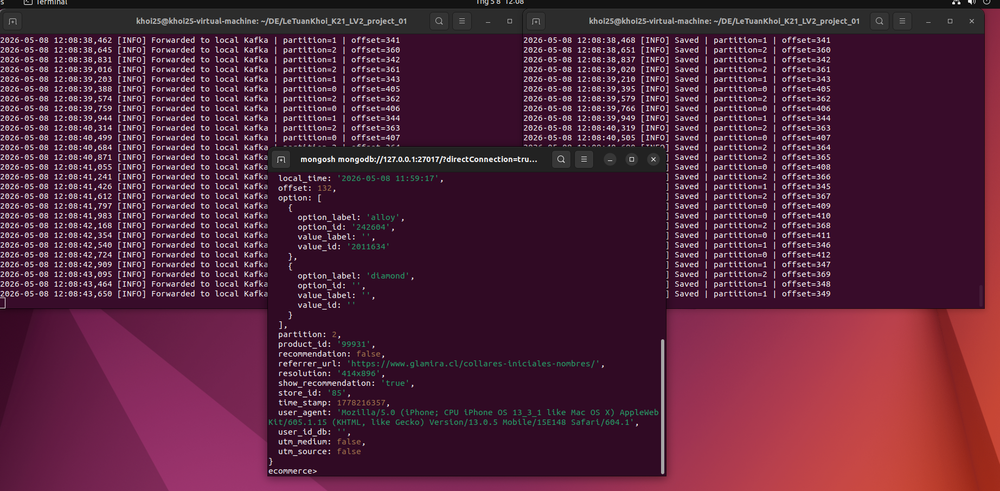

# Project 01 — Kafka Stream Pipeline to MongoDB

## Architecture
External Kafka (46.202.167.130)     Local Kafka (localhost:9094)
topic: product_view      →          topic: raw-events          →   MongoDB
producer.py                          consumer.py

## Features
- Stream mode: reads live data continuously from external Kafka source
- Exactly-once: `enable_idempotence=True` at producer + upsert by event `id` at consumer
- Resume mechanism: offset committed only after successful MongoDB insert
- Validation: messages missing required fields are skipped
- Config via .env: no hardcoded credentials
- Fault tolerant: connection timeout tuned to prevent broker disconnection

## Setup
```bash
git clone <repo-url>
cd LeTuanKhoi_K21_LV2_project_01
python -m venv .venv
source .venv/bin/activate
pip install -r requirements.txt
cp .env.example .env
# Fill in values in .env
```

## Run
```bash
# Terminal 1 — read from external Kafka, forward to local Kafka
python producer.py

# Terminal 2 — read from local Kafka, save to MongoDB
python consumer.py
```

## Result


## Requirements
- Kafka cluster running (bootstrap server configured in .env)
- MongoDB instance running and accessible